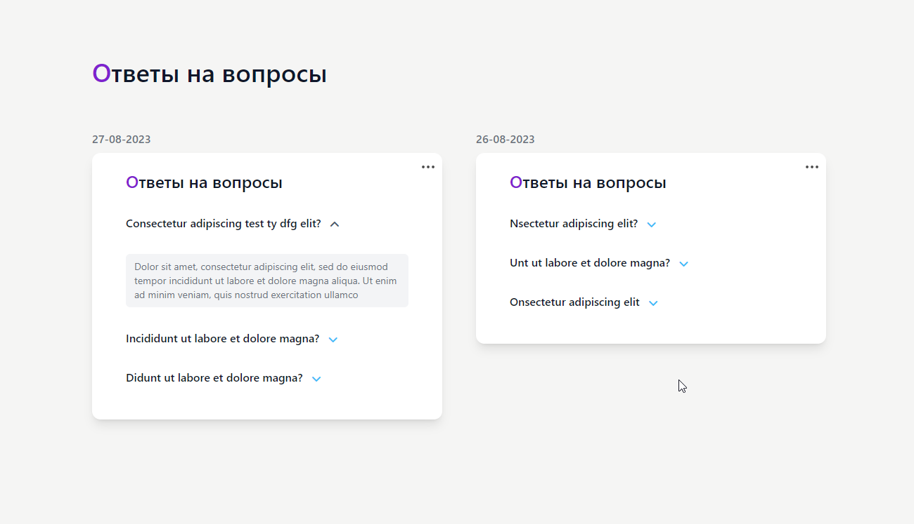

## Imtera Laravel App

Протестировать online можно здесь:

```
https://new-test.getyoursite.info/
```

В приложении можно публиковать вопросы и ответы 



### Меню 'Контент'

Чтобы открыть окно редактирования вопросов и ответов нужно кликнуть иконку 'точки'.


Чтобы сохранить отредактированный текст вопроса или ответа нужно кликнуть кнопку 
'Сохранить'. Удалить вопрос или ответ - кликнуть кнопку 'Удалить'.

Нельзя удалить ответ, если его нет (кнопка 'Удалить' будет не активна).
При удалении вопроса связанный с ним ответ тоже удаляется.


Если у вопроса нет ответа пользователь видит сообщение:


Вопросы сгруппированы по дате их создания. Если вы добавляете вопрос в группу
с текущей датой, то новый вопрос попадает в эту же группу.

Если вы добавляете первый вопрос на текущую дату, то формируется новая группа
с новым вопросом.

Чтобы добавить новый вопрос прокрутите вниз список вопросов и нажмите
ссылку 'Добавить вопрос'. Появится форма. Создайте вопрос и нажмите кнопку
'Добавить вопрос'.


Все поля ввода проверяются на наличие 'плохих' символов. Если пользователь отправляет
пустую форму или запрещенные символы, то он получает сообщение.


Если вопросов нет, то пользователь увидит форму для добавления вопроса и сможет 
добавить новый вопрос.


### Меню 'Дизайн'

Можно изменять отступы сверху и снизу элементов указанных красными стрелками:


Цифры это: 1 - 16px, 2 - 32px, 2 - 48px, 4 - 64px. Текущее значение выделено
синим цветом.

Чтобы изменить значение нужно кликнуть на нужную цифру.
